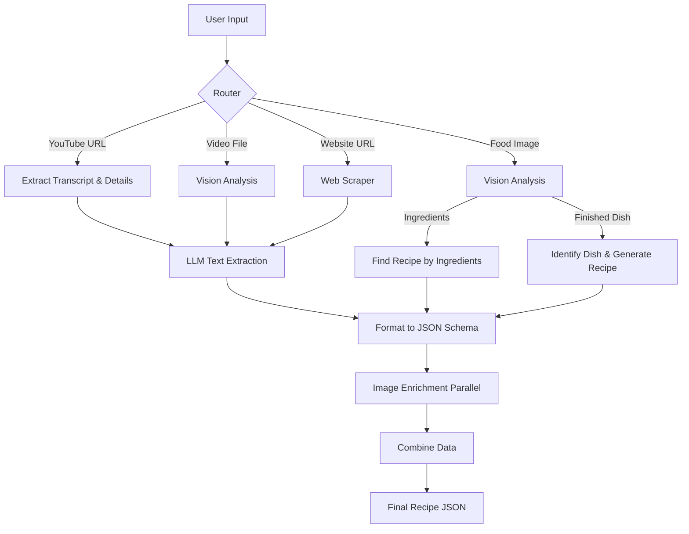

# PlateIt AI Agent 🧠

The Core Intelligence of the application. This module orchestrates complex culinary workflows using **LangGraph** and is powered by **Google Gemini 3.0 Flash Preview**.

## 🚀 The "Better Agent" Workflow

The agent is designed as a state machine that can handle multiple types of inputs (Text, YouTube Links, Images, Videos) and convert them into a structured `Recipe` format.

---

## 🛠️ The Chef's Toolkit

The agent has access to a specialized suite of tools, allowing it to interact with the real world:

### 1. Vision Capability
- **`analyze_image`**: Determines if an image is raw ingredients or a cooked meal.
- **`pantry_scan`**: Identifies multiple items in a single photo for inventory using Gemini 3's native multimodal powers.

### 2. Information Retrieval
- **`search_recipes`**: Queries Spoonacular for verified recipes.
- **`find_by_ingredients`**: Reverse search—finds what you can cook with what you have.
- **`search_youtube`**: Finds relevant video tutorials with thumbnails.
- **`google_search`**: General culinary knowledge retrieval.

### 3. Data Processing
- **`extract_video_id`**: Parses YouTube URLs.
- **`download_video_file`**: Handles social media video downloads for deep multimodal analysis.

---

## 🤖 Why Gemini 3?

We utilize **Gemini 3.0 Flash Preview** as our primary orchestrator for several reasons:
1.  **Multimodal Native**: It can "see" food images and "watch" cooking videos directly without needing separate OCR or complex frame-extraction pipelines.
2.  **Long Context Window**: Essential for processing full video transcripts or lengthy blog posts to extract accurate recipe steps.
3.  **Advanced Reasoning**: Acts as the "Orchestrator" in our multi-agent setup, delegating tasks to other models (like GPT-4o for JSON formatting) while maintaining the creative vision.
4.  **Speed**: The Flash model provides near-instant responses, crucial for real-time cooking assistance.

---

## 📂 Key Files

- **`better_agent.py`**: The main LangGraph workflow definition (using Gemini 3 as the Orchestrator).
- **`chef_agent.py`**: The conversational persona (Chatbot) logic for the step-by-step assistant.
- **`agent_server.py`**: The FastAPI entry point for all mobile app interactions.
- **`tools.py`**: The complete library of external tool functions.
- **`schemas.py` / `models.py`**: Pydantic and SQLModel definitions for data validation and persistence.
