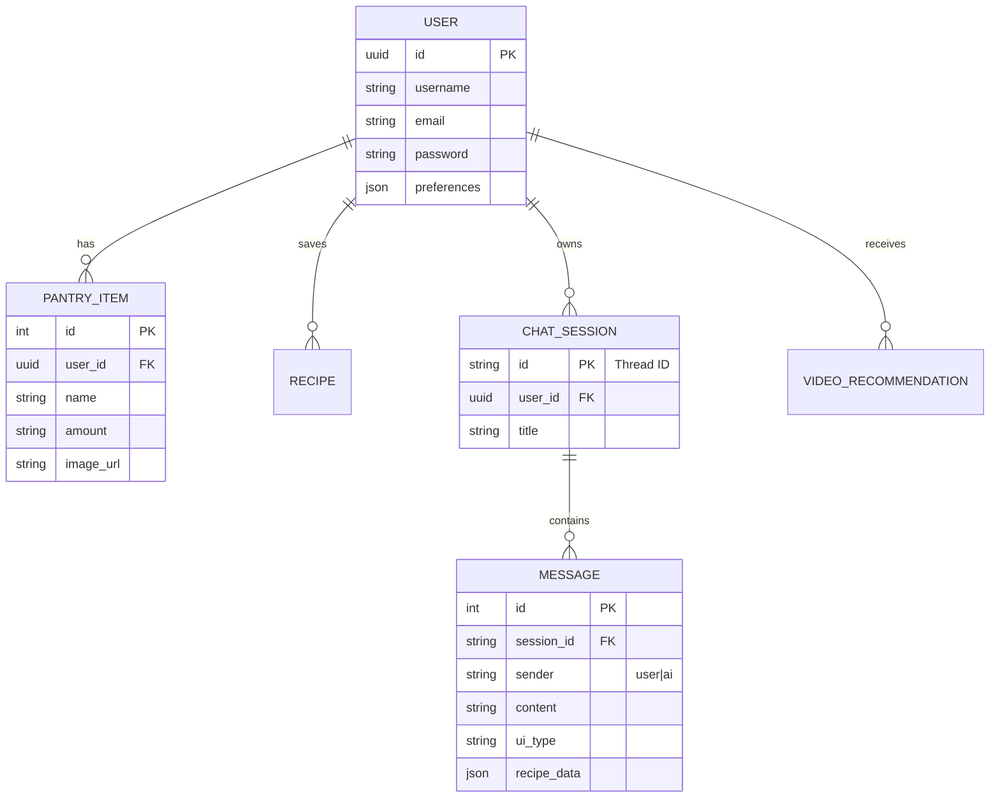

# PlateIt Backend 🐍

The PlateIt Backend is a robust FastAPI service responsible for handling user authentication, data management (via Supabase), and orchestrating AI-driven interactions using LangGraph and Google Gemini 3.

## 🏗️ Architecture

### Database Schema (ER Diagram)

The backend uses a relational database model managed by Supabase (PostgreSQL). Below is the Entity-Relationship logic:



---

## 🔌 API Endpoints

### Authentication & User
- `POST /signup`: Register a new user.
- `POST /signin`: Authenticate user.
- `GET /users/profile/{user_id}`: Fetch user profile details.
- `POST /users/preferences`: Update culinary preferences.
- `GET /users/stats/{user_id}`: Get cooking statistics (recipes, sessions, active days).

### Pantry Management
- `POST /pantry/scan_image`: Upload a photo to detect ingredients (Gemini 3 Vision).
- `POST /pantry/add`: Manually add an item.
- `GET /pantry/{user_id}`: Retrieve all pantry items.
- `DELETE /pantry/{item_id}`: Remove an item.

### AI & Recipes
- `POST /chat`: Interact with the Chef Agent (Context-aware, supports multimodal inputs).
- `GET /chat/sessions/{user_id}`: List all chat history threads.
- `GET /chat/history/{thread_id}`: Fetch messages for a specific session.
- `POST /extract_recipe`: Convert a YouTube/Web URL into a structured recipe.
- `POST /extract_recipe_image`: Convert a recipe photo into structured JSON.
- `POST /recipes/identify_dish`: Identify a cooked dish from an image and generate its recipe.
- `GET /recipes/findByIngredients`: Discover recipes based on pantry items.
- `GET /recipes/{recipe_id}/full`: Get detailed info for a specific recipe ID.

### Recommendations
- `GET /recommendations/videos/{user_id}`: Get personalized YouTube cooking video suggestions based on preferences.

---

## 🛠️ Setup & Run

1. **Install Dependencies**:
   ```bash
   cd Agent
   pip install -r requirements.txt
   ```

2. **Environment Variables**:
   Create a `.env` file in the `Agent/` directory:
   ```env
   DATABASE_URL=your_supabase_url
   GEMINI_API_KEY=your_google_ai_key
   OPEN_API_KEY=your_openai_key
   SPOONACULAR_API_KEY=your_spoonacular_key
   PEXELS_API_KEY=your_pexels_key
   ```

3. **Start Server**:
   ```bash
   # From the /BackEnd/Agent directory
   uvicorn agent_server:app --reload --host 0.0.0.0 --port 8080
   ```
