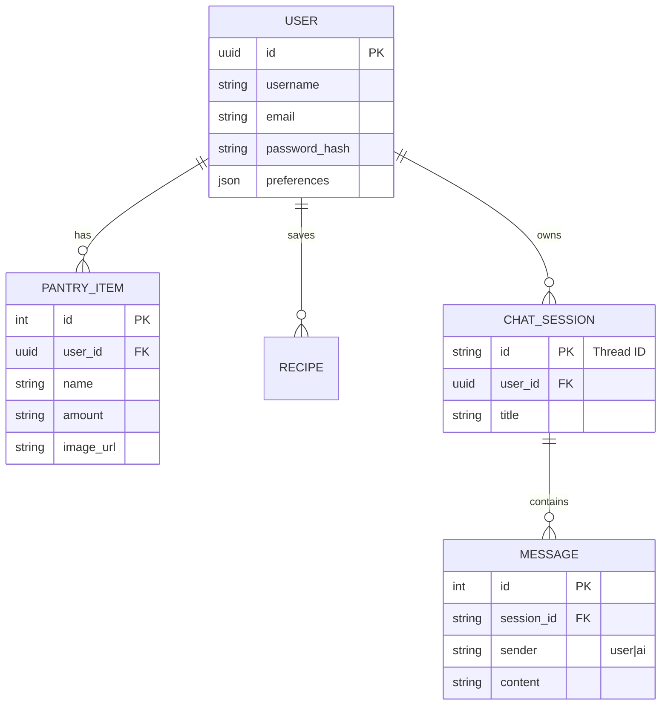

# PlateIt Backend 🐍

The PlateIt Backend is a robust FastAPI service responsible for handling user authentication, data management (via Supabase), and orchestrating AI-driven interactions.

## 🏗️ Architecture

### Database Schema (ER Diagram)

The backend uses a relational database model managed by Supabase (PostgreSQL). Below is the Entity-Relationship logic:



---

## 🔌 API Endpoints

### Authentication
- `POST /signup`: Register a new user.
- `POST /signin`: Authenticate user and receive user details.
- `POST /preferences`: Update user culinary preferences.

### Pantry Management
- `POST /pantry/scan`: Upload an image to detect ingredients (Vision Agent).
- `POST /pantry/add`: Manually add an item.
- `GET /pantry`: Retrieve all pantry items for a user.
- `DELETE /pantry/{item_id}`: Remove an item.

### AI & Recipes
- `POST /chat`: Interact with the AI Chef Agent (Supports text + image inputs).
- `GET /recipes/search`: Find recipes based on query.
- `GET /recipes/findByIngredients`: Discover recipes using pantry items.
- `POST /recipes/identify_dish`: Upload a dish photo to get its recipe.

---

## 🛠️ Setup & Run

1. **Install Dependencies**:
   ```bash
   cd Agent
   pip install -r requirements.txt
   ```

2. **Environment Variables**:
   Ensure your `.env` file is configured with `DATABASE_URL` and API keys.

3. **Start Server**:
   ```bash
   uvicorn agent_server:app --reload --host 0.0.0.0 --port 8080
   ```
